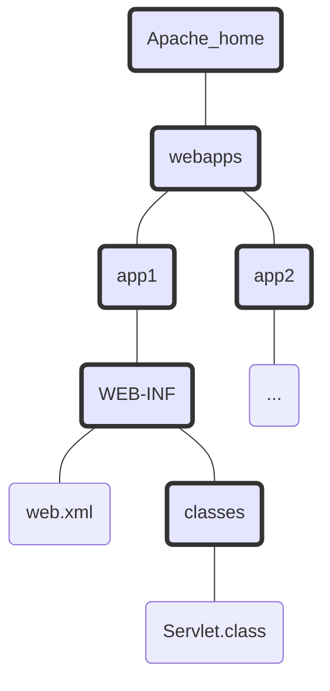

[TOC]


### Web服务器

* Web服务器接受客户请求，然后向客户（Web浏览器）返回一些结果
* 服务器的响应包含客户所请求的具体的文档（如果无法处理客户的请求，就会返回一个错误码）

### HTML

* HTML是超文本标记语言
* HTML告诉浏览器怎么把内容呈现给客户
* 所有Web浏览器都知道如何处理HTML

### HTTP

* HTTP是Web上客户和服务器之间进行通信所有的协议
* 服务器使用HTTP向客户发送HTML
* 客户发送一个HTTP请求，服务器会用一个HTTP响应做出应答
* HTML是HTTP响应的一部分

#### 请求-GET

```http
GET /companyInfo/queryCompanyInfo?enterpriseId=1 HTTP/1.1
Host: localhost:8088
Connection: keep-alive
Accept: */*
User-Agent: Mozilla/5.0 (Windows NT 10.0; WOW64) AppleWebKit/537.36 (KHTML, like Gecko) Chrome/55.0.2883.87 Safari/537.36
Referer: http://localhost:8088/swagger-ui.html
Accept-Encoding: gzip, deflate, sdch, br
Accept-Language: zh-CN,zh;q=0.8
Cookie: JSESSIONKEY=1a2b3a3f-cefb-4f7c-b62d-125ff09e80f1
```

#### 请求-POST

```http
POST /channelOrg/updateChannelOrg HTTP/1.1
Host: crm-web-216.hrlyit.com
Connection: keep-alive
Content-Length: 438
Accept: application/json, text/plain, */*
Origin: https://crm-web-216.hrlyit.com
X-Requested-With: XMLHttpRequest
User-Agent: Mozilla/5.0 (Windows NT 10.0; Win64; x64) AppleWebKit/537.36 (KHTML, like Gecko) Chrome/73.0.3683.86 Safari/537.36
Content-Type: application/json;charset=UTF-8
Referer: https://crm-web-216.hrlyit.com/index.html
Accept-Encoding: gzip, deflate, br
Accept-Language: zh-CN,zh;q=0.9
Cookie: JSESSIONKEY=6a521f55-0d5d-4404-afd8-5409036f2043

{"acctName":"河北乐言电子科技有限公司","acctNo":"50358801040004243","bankName":"中国农业银行石家庄联城支行","checkingEmail":"15903114567@139.com","checkingPerson":"李晓娟","checkingPersonPhone":"13032656118","channelType":"ENTERPRISE_AGENT","id":1702,"name":"河北乐言电子科技有限公司","status":"Y","remark":null,"channelManagerId":2029,"agentProvince":null,"agentCity":null,"agentIdentity":null}
```

#### 响应

```http
HTTP/1.1 200 OK
Server: nginx
Date: Wed, 10 Apr 2019 14:13:19 GMT
Content-Type: application/json;charset=UTF-8
Transfer-Encoding: chunked
Connection: keep-alive
Vary: Accept-Encoding
Set-Cookie: rememberMe=deleteMe; Path=/; Max-Age=0; Expires=Tue, 09-Apr-2019 14:13:22 GMT
Set-Cookie: JSESSIONKEY=deleteMe; Path=/; Max-Age=0; Expires=Tue, 09-Apr-2019 14:13:22 GMT
Content-Encoding: gzip
```

* Content-Type (内容类型)响应首部的值称为==MIME==类型。MIME类型告诉浏览器要接收的数据是什么类型，浏览器才知道如何去显示这些数据，MIME类型值与==HTTP请求“Accept”首部==中所列的值有关

### Apache网站的目录结构



* Apache 服务器将==webapps==是服务器上所有Web应用的根目录

### web.xml

部署描述文件（DD）

```xml
<?xml version="1.0" encoding="utf-8" ?>
<web-app xmlns="http://java.sun.com/xml/ns/j2ee"
	xmlns:xsi="http://www.w3.org/2001/XMLSchema-instance"
	xsi:schemaLocation="http://java.sun.com/sml/ns/j2ee
	http://java.sun.com/xml/ns/j2ee/web-app_2_4.xsd"
	version="2.4">
	
	<servlet>
		<servlet-name>Chapter1 Servlet</servlet-name>
		<servlet-class>Ch1Servlet</servlet-class>
	</servlet>
	
	<servlet-mapping>
		<servlet-name>Chapter1 Servlet</servlet-name>
		<url-pattern>/Serv1</url-pattern>
	</servlet-mapping>

</web-app>
```

* web-app头部标识表示 使用与servlet2.4规范兼容的容器

#### servlet的三个名字

* url-pattern :客户知道的URL名
* servlet-name : 部署文件中的部署名
* servlet-class: 实际的文件名（完整限定类名，包括包名）
