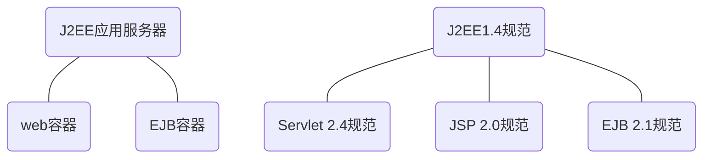

[TOC]

### 容器

请求到来时，实例化servlet / 建立一个新的线程处理这个请求

调用servlet 的 doPost() / doGet() 方法

将HTTP请求个HTTP响应对象交给servlet

管理servlet的生死以及servlet的资源

Servlet没有 main() 方法，受控于另一个Java应用-容器

* ==通信支持==  利用容器的方法，可以轻松的让servlet与Web服务器对话。无需自己建立serverSocket、监听端口、创建流等；专注于servlet中实现业务逻辑
* ==生命周期管理== 容器控制servlet的生死，负责==加载、实例化、初始化servlet，调用servlet方法，使servlet实例能够被垃圾回收==，在容器的控制下，不用过多考虑资源管理
* ==多线程支持== 容器会自动的为它接受的每个servlet请求创建一个新的Java线程
* ==声明方式安全== 利用容器，可以使用XML部署描述文件来配置和修改安全性，不必将其硬编码到servlet（或其他）类代码中
* ==JSP支持== 容器将JSP代码翻译成真正的Java

### MVC

模型-视图-控制器（MVC）就是把业务逻辑从servlet中抽离出来，把它放在一个“模型”中，所谓模型就是一个可重用的Java类。模型是业务数据（如购物车的状态）和处理该数据的方法（规则）的组合，系统中只有这部分与数据库通信

* 模型：普通Java类
* 视图：JSP
* 控制器：servlet

### J2EE

