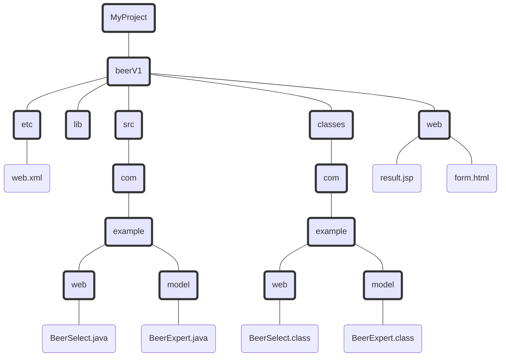
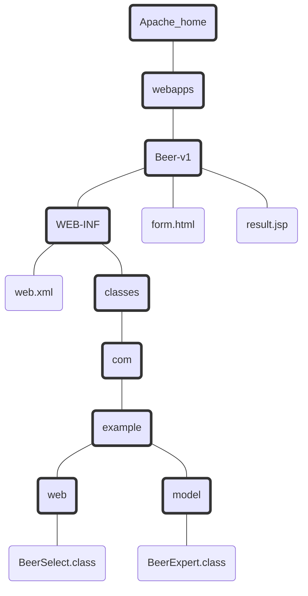

[TOC]

### 构建真正的（小）Web应用

#### 开发环境


```mermaid
graph TB
  	MyProject(MyProject) --- beerV1(beerV1)
  	beerV1 --- etc(etc)
  	beerV1 --- lib(lib)
  	beerV1 --- src(src)
  	beerV1 --- classes(classes)
  	beerV1 --- web(web)
  	
  	etc --- web.xml(web.xml)
  	
  	src --- com(com)
  	com --- example(example)
  	example --- web1(web)
  	example --- model(model)
  	web1 --- BeerSelect.java(BeerSelect.java)
  	model --- BeerExpert.java(BeerExpert.java)
  	
  	classes --- com1(com)
  	com1 --- example1(example)
  	example1 --- web2(web)
  	example1 --- model1(model)
  	web2 --- BeerSelect(BeerSelect.class)
  	model1 --- BeerExpert(BeerExpert.class)
  	
  	web --- result(result.jsp)
	web --- form(form.html)  	
  	
  	
  	
  	
  	classDef wenjianjia fill:#ccf,stroke:#333,stroke-width:4px,fill-opacity:0.5
  	class MyProject,beerV1,etc,lib,src,classes,web,com,com1,example,example1,web1,web2,model,model1 wenjianjia
```

==编译命令：==

```shell
javac -classpath /your path/tomcat/lib/servlet-api.jar;classes;. -d classes src/com/web/BeerSelect.java
```


#### 部署环境


```mermaid
graph TB
  	apache_home(Apache_home) --- webapps(webapps)
  	webapps --- app1(Beer-v1)
  	app1 --- WEB-INF(WEB-INF)
  	WEB-INF --- web.xml(web.xml)
  	WEB-INF --- classes(classes)
  	app1 --- form(form.html)
  	app1 --- result(result.jsp)
  	
  	classes --- com1(com)
  	com1 --- example1(example)
  	example1 --- web2(web)
  	example1 --- model1(model)
  	web2 --- BeerSelect(BeerSelect.class)
  	model1 --- BeerExpert(BeerExpert.class)
  	
  	
  	
  	
  	
  	classDef wenjianjia fill:#ccf,stroke:#333,stroke-width:4px,fill-opacity:0.5
  	class apache_home,webapps,app1,com1,WEB-INF,classes,example1,web2,model1 wenjianjia
```

