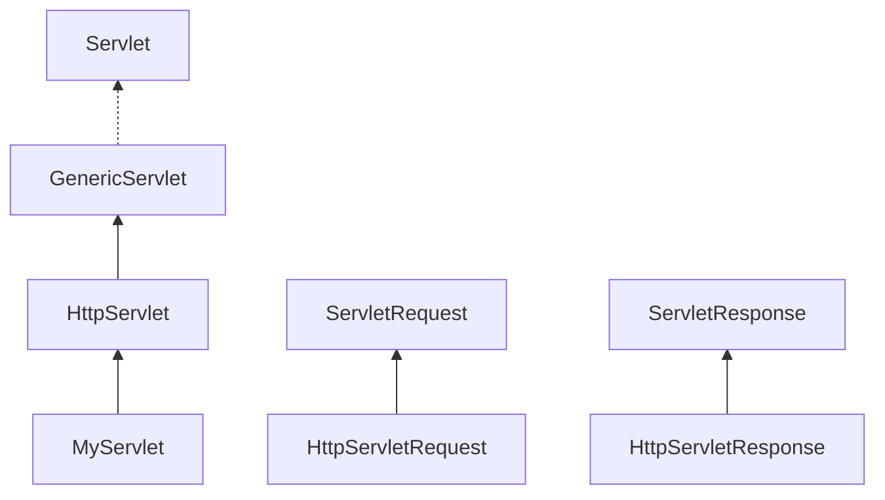

[TOC]

### Servlet的一生

* 容器启动时，寻找已经部署的web应用，开始搜索servlet类文件，容器找servlet类文件时，servlet的生命开始

* 加载类，可能发生在容器启动时，也可能在第一个客户使用使用时加载

* 初始化servlet（构造函数运行）不要在servlet的构造函数放任何东西，构造函数开始，使之成为一个普通对象

* init() ，容器为此生成一个ServletConfig，调用init()，此时，才是真正的servlet对象，init() 在servlet一生中只运行一次，总是在第一个service()方法调用之前完成

* service() 容器调用，此方法再根据客户发出的HTTP方法(Get)，确定要调用哪个servlet方法（doGet()）

* destroy() 线程结束后，可以被回收


### API




#### Servlet（interface）

```
service(ServletRequest,ServletResponse)
init(ServletConfig)
destroy()
getServletConfig()
getServletInfo()
```

##### GenericServlet（抽象类）

```
service(ServletRequest,ServletResponse)
init(ServletConfig)
init()
destroy()
getServletConfig()
getServletInfo()
getInitParameter(String)
getInitParameterNames()
getServletContext()
log(String)
log(String,Throwable)
```

##### HttpServlet（抽象类）

```
service(HttpServletRequest,HttpServletResponse)
service(ServletRequest,ServletResponse)
doGet(HttpServletRequest,HttpServletResponse)
doPost(HttpServletRequest,HttpServletResponse)
doHead(HttpServletRequest,HttpServletResponse)
doOptions(HttpServletRequest,HttpServletResponse)
doPut(HttpServletRequest,HttpServletResponse)
doTrace(HttpServletRequest,HttpServletResponse)
doDelete(HttpServletRequest,HttpServletResponse)
getLastModified(HttpServletRequest)
```


#### ServletRequest

```
getAttribute(String):Object
getContentLength():int
getInputStream():ServletInputStream
getReader():BufferReader
getLocalPort():int
getParameter(String):String
getParameterNames():Enumeration
```


##### HttpServletRequest

```
getContextPath():String
getCookies():Cookie[] //与请求相关
getHeader(String):String
getQueryString():String
getSession():HttpSession //与客户相关
getMethod():String
```


#### ServletResponse

```
getBufferSize():int
setContentType(String):void
setContentLength(int):coid
getOutputStream():ServletOutputStream
getWriter():PrintWriter
```


##### HttpServletResponse

```
addCookie(Cookie):void
addHeader(String name,String value):void
encodeRedirectURL(String url):String
sendError(int):void
sendStatus(int):void
```


* getReader() / getInputStream()。这些流只包含HTTP请求的体，不包含首部
* 任何特定Servlet类都只有一个实例
* GenericServlet类实现了Servlet接口
* 总是先调用response.setContenetType(),再调用获得输出流（getWriter()/getOutPutStream()）,这样可避免内容类型（MIME）和输出流之间的冲突
* ServletOutputStream输出字节数据，PrintWriter输出字符数据

