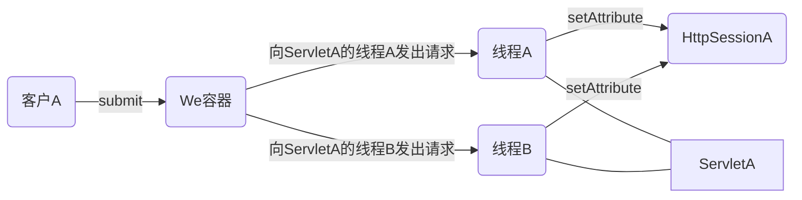
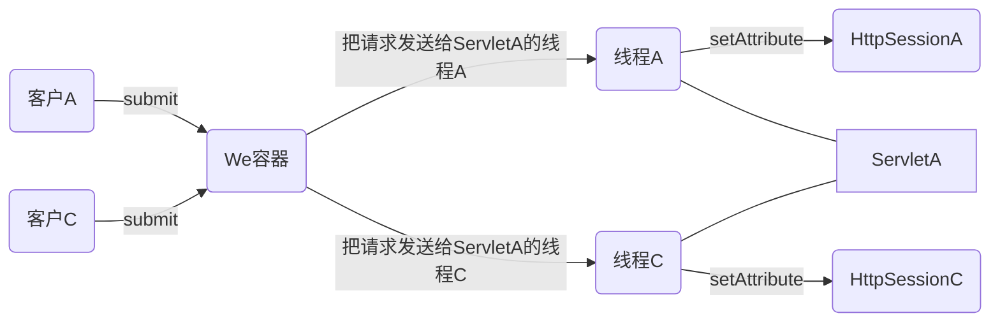

[TOC]

## HttpSession

* HttpSession对象可以保存跨同一个客户（浏览器）多个请求的会话状态
* 与一个特定客户的整个会话期间，HttpSession会持久存储
* 对于会话期间客户做的所有请求，从中得到的所有信息都可以用HttpSession对象保存


### 会话如何工作



* 相同的客户，相同的servlet，不同的请求，不同的线程，相同的会话




* 不同的客户，相同的servlet，不同的请求，不同的线程，不同的会话


#### web容器怎么知道客户是谁

* HTTP协议使用的是无状态连接。客户与服务器建立连接，发出请求，得到响应，然后关闭连接。即连接只为了一个请求/响应存在
* 由于连接不会持久保留，所以容器认不出做第二个请求的客户与前一个做请求的客户是同一个客户。对容器而言，==每个请求都来自于一个新的客户==


##### 解决之道：通过一个唯一的会话ID

* 对客户的第一个请求，容器会生成一个唯一的会话ID，并通过响应把它返回给客户。客户再在以后的每一个请求中发回这个会话ID。容器看到ID后，就会找到匹配的会话，并把这个会话与请求关联


##### 客户和容器如何交换会话ID信息：Cookie

* 容器必须以某种方式把会话ID作为响应的一部分交给客户

  ```http
  HTTP/1.1 200 OK
  Set-Cookie:JSESSIONID=0AAB67CB415
  Content-Type:text/html
  
  <html>
  	...
  </html>
  ```

* 客户必须把会话ID作为请求的一部分发回

  ```http
  POST /SELECT/selectBeerTaste2.do HTTP/1.1
  Host:www.bior.com
  User-Agent:Mozilia/5/0
  Cookie:JSESSIONID=0AAB67CB415
  ACCEPT:text/html
  ```

* 容器几乎会做cookie的所有工作

  * 你必须告诉容器想 ==创建或使用一个会话==
  * 容器负责：生成会话ID、创建新的cookie对象、把会话ID放到cookie中、把cookie设置为响应的一部分等等工作
  * 对于后续的请求，容器会从请求中的cookie得到会话ID，将这个会话ID与一个现有的会话匹配，并把会话与当前请求关联


###### 在响应中发送一个会话cookie

```java
/**
*	不用自己建立新的HttpSession对象
*	不必生成唯一的会话ID
*	不用自己建立新的Cookie对象
* 	不用把会话ID与cookie关联
*	不用在响应中设置Cookie(在Set-Cookie首部下)
*	cookie的所有工作都在后台进行
*/
HttpSession session = request.getSession();
```


###### 从请求中得到会话ID

```java
/**
*	与为响应生成会话ID和cookie时所用的方法完全一样
*/
HttpSession session = request.getSession();
```


###### 创建HttpSession

```java
//HttpServletRequest
/**
*	若存在旧会话，返回旧会话
*	不存在旧会话，创建一个新会话，与当前请求关联，并返回
*/
HttpSession getSession();
/**
*	返回一个已存在的旧会话，若不存在，返回null
*/
HttpSession getSession(false);
/**
*	与getSession()完全一样
*/
HttpSession getSession(true);


//HttpSession
/**
*	如果客户还没有用过这个 会话ID 做过响应，返回true，即为新会话
*/
boolean isNew();
```

* 还可以从会话相关的监听者的时间类型得到会话: HttpSessionEvent/HttpSessionBindingEvent


###### 后路：URL重写

* 客户不接受cookie，不会有异常，会忽略“Set-Cookie”响应首部，getSession()时总会返回一个新会话（isNew()返回true）客户也不会发出一个带有会话ID cookie首部的请求

* 交换会话ID，来回传递cookie是最简单的方法。URL重写能取得置于cookie中的会话ID，并把会话ID附加到访问应用的各个URL的最后: ==URL;jsessionid=123456

  ```http
  //HTTP响应
  HTTP/1.1 200 OK
  Content-length:397
  
  <html>
  	<body>
  		<a href="www.bior.com/BeerTest.do;jsessionid=0AAB6C8899">
  		click me
  		</a>
  	</body>
  </html>
  
  //HTTP请求
  GET/BeerTest.do;jsessionid=0AAB6C8899
  HTTP/1.1
  Host:www.bor.com
  ...
  ```

* 到达容器的请求会在最后携带这个额外信息，容器会取下请求URL中这个额外部分，并用它查找匹配的对话，不一定都是用分号做分隔符，不同开发商可采用不同分隔符

* 不能用cookie时，只有告诉==响应要对URL编码==，URL重写才能奏效

  ```java
  public void doGet(HttpServletRequest request,HttpServletResponse response){
      
      response.setContentType("text/html");
      PrintWriter out = response.getWriter();
      HttpSession session = request.getSession();
      
      out.println("<a href=\"" + response.encodeURL("/BeerTest.do") + "\">click me</a>");
  }
  ```

* 使用重定向sendRedirect()时，想使用同一个会话

  ```java
  response.encodeRedirectURL("/BeerTest.do");
  ```

* 不能对静态页面HTML完成URL重写，要使用URL重写，页面必须是动态生成，可以在JSP中完成URL重写

* URL编码只与响应有关，encodeURL()方法睡觉是HttpServletResponse对象上调用的的方法

* 唯一可以放“JSESSIONID”的地方就是cookie首部中


##### HttpSession API

* 调用getSession()时，关心的只是得到一个实现了HttpSession接口的类实例。创建具体的实现是容器的任务

```java
long getCreatTime();//返回第一次创建会话的时间
long getLastAccessedTime();//返回容器最后一次得到包含这个会话ID的请求后过去了多长时间
void setMaxInactiveInterval(int);//指定对于这个会话客户请求的最大间隔时间
int getMaxInactiveInterval();//返回对于这个会话客户请求的最大时间间隔
void invalidate();//结束会话。当前存储在这个会话中的所有会话属性也会接触绑定
ServletContext getServletContext();//
boolean isNew();//
String getId();
Object getAttribute(String);//
void setAttribute(String,Object);//
void removeAttribute(String);//
...


```


##### 删除会话：会话3中死法

###### 超时

* 在DD中配置会话超时：在DD中配置会话超时与所创建每一个会话上调用setMaxInactiveInterval()有同样的效果

  ```xml
  <web-app>
  	<servlet>
          ...
      </servlet>
      
      <session-config>
          <!-- 15是指15分钟 -->
      	<session-timeout>15</session-timeout>
      </session-config>
  </web-app>
  ```

* 设置一个特定会话的会话超时：如果你想改变某个特定会话实例的session-timeout值（而不影响应用中其他会话的超时时间）

  ```java
  //只有对会话调用这个方法才有意义，这个方法的参数以秒为单位，表示如果客户20分钟没有对此会话做任何请求，就杀死他
  session.setMaxIntactiveInterval(20*60);
  ```


###### 在会话对象上调用invalidate()

###### 应用结束（崩溃或取消部署）


##### Cookie的其他作用

*  可以使用cookie在服务器和客户之间交换名/值String对
* 服务器吧=把cookie发送给客户，客户再在以后的每个请求中发回这个cookie
* 客户的浏览器退出时，会话cookie就会消失，但是你可以告诉cookie在客户端上待得更久一些，甚至在浏览器关闭之后还持久保存


##### 关于Cookie API

* 对于cookie的操作，已经封装在三个类的Servlet API中：HttpServletRequest,HttpServletResponse,Cookie

  ```java
  // HttpServletRequest
  Cookie[] getCookies();
  
  //	HttpServletResponse
  void addCookie(Cookie);
  
  //	Cookie
  Cookie Cookie(String,String);
  String getDomain();
  int getMaxAge();
  String getName();
  String getValue();
  String getPath();
  boolean getSecure();
  void setDomain(String);
  void setMaxAge(int);
  void setPath(String);
  void setValue(String);
  ```

  ```java
  //创建一个新Cookie
  //Cookie构造函数取一个名/值String对作为参数
  Cookie cookie = new Cookie("username",name);
  
  //设置cookie在客户端存活多久
  //setMaxAge以秒为单位定义，若设为“-1”，那么浏览器退出时cookie会消失
  cookie.setMaxAge(30*60)；
  
  //把cookie发送给客户
  response.addCookie(cookie);
  
  //从客户请求得到cookie(或多个cookie)
  Cookie[] cookies = request.getCookies();
  for(int i = 0;i < cookies.length; i++){
      Cookie cookie = cookies[i];
      if(cookie.getName().equals("username")){
          String username = cookie.getValue();
          out.println("Hello "+ username);
          break;
      }
  }
  ```

* 不要把Cookie与首部混为一谈


##### HttpSession对象一生中的重要时刻

* 创建或撤销会话
* 由应用的其他部分增加、删除或替换会话属性
* 会话在一个VM中钝化，并在一个分布式应用中的另一个VM中激活


###### 会话生命周期事件

* 生命周期

  ```markdown
  ### 创建会话
  * 容器第一次创建一个会话。此时，会话还是新的（客户还没有用这个会话ID发送请求）
  
  ### 撤销会话
  * 容器置一个会话无效（会话超时，或者应用某个部分调用了会话的invalidate()方法）
  
  ### 事件和监听者类型
  HttpSessionEvent
  HttpSessionListener
  
  ```

* 属性

  ```markdown
  ### 增加一个属性
  * 应用的某个部分对会话调用setAttribute()
  
  ### 删除一个属性
  * 应用的某个部分对会话调用removeAttribute()
  
  ### 替换一个属性
  * 应用的某个部分对会话调用setAttribute(),而这个属性名原来已经绑定到会话
  
  ### 事件和监听者类型
  HttpSessionBindingEvent
  HttpSessionAttributeListener
  ```

* 迁移

  ```markdown
  ### 会话准备钝化
  * 容器打算把会话迁移（移动）到另一个VM中。要在会话移动之前调用，这样就能让属性有机会做好迁移的准备
  
  ### 会话已经激活
  * 容器已经把会话迁移（移动）到另一个VM中。要在应用的其他部分对会话调用getAttribute()之前调用，这样刚移动的属性就有机会做好准备以供访问
  
  ### 事件和监听者类型
  HttpSessionEvent
  HttpSessionActivationListener
  ```


##### 会话迁移

* 只有HttpSession对象（及其属性）会从一个VM移到另一个VM
* 每个VM中有一个ServletContext，每个VM上的每个servlet有一个ServletConfig。
* 但是对于每个Web应用的一个给定的会话ID，只有一个HttpSession对象，而不论应用分布在多少个VM上
* 除了HttpSession之外，所有其他对象都会在另外一个VM上复制


##### HttpSessionActivationListener使属性做好准备大搬家

```java
sessionDidActivate(HttpSessionEvent);//激活
sessionWillPassivate(HttpSessionEvent);//钝化
```


* 如果你的属性都是直接的Serializable对象，并不关心它们最后会放在哪里，那么可能就不会应用到这个监听者

* 这个监听者最常用的用法就是为属性提供一个机会，使它的实例变量准备好串行化

* 会话迁移和串行化

* 容器需要迁移Serializable属性（假设属性中的所有实例变量都要么是Serializable，要么为null）

* 容器不一定使用串行化（Serialization）来迁移HttpSession对象

  ```txt
  1.确保你的属性类类型是Serializable，那就不用操心
  2.如果属性类型不是Serializable(可能因为属性对象的某个实例变量不是Serializable)，可以让属性对象实现HttpSessionActivationListener，并使用激活/钝化回调方法解决这个问题
  ```

* 容器不一定非得使用串行化，所以不能保证会对一个Serializable属性或某个实例变量调用readObject()和writeObject()

  ```
  1.实现了Serializable的类还可以实现一个writeObject()方法，串行化对象时就由VM调用这个方法
  2.还可以实现一个readObject()方法，在对象逆串行化时调用
  3.Serializable对象使用这些方法做事，在串行化期间把非Serializable的字段设置为null(writeObject()),然后在逆串行化期间再恢复这些字段（readObject()）
  4.会话迁移不一定会调用这些方法!如果你想保存和恢复属性中的实例变量状态，可以使用HttpSessionActivationListener,并使用两个事件的回调方法（sessionDidActivate()和sessionWillPassivate()），就像使用readObject()和writeObject()一样
  ```

  
