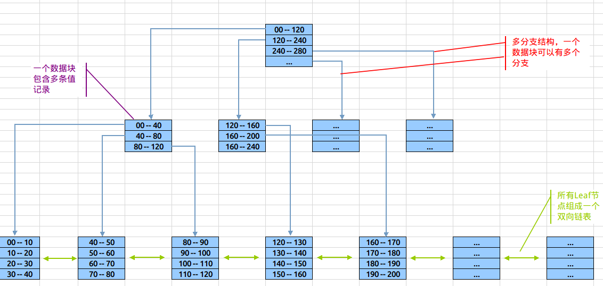

[5.创建高性能的索引](#5-创建高性能的索引)

​	[5.1索引基础](#51-索引基础)

​	[5.2索引的三大优点](#52-索引的三大优点)


# 5. 创建高性能的索引

索引，MySQL也叫“键（key）”，是存储引擎用于快速找到记录的一种数据结构，这是索引的基本功能。

索引对于良好的性能非常关键。当表中的数据量越来越大时，索引对性能的影响越重要。

不恰当的索引，在数据量较小且负载较低时，对性能影响不大，当数据量逐渐增大时，性能会**急剧下降**

**索引优化是对查询性能优化的最有效的手段**。索引能轻易**将查询性能提高几个数量级。**

“最优”的索引有时会比一个“好的”索引性能要好2个数量级。

创建一个真正”最优“索引经常需要重写查询。-- ?

---

### 5.1 索引基础

* **索引是如何工作的？**

例子：你想要在一本书中找到某个特定的主题，你可以去看看这本书的”索引“（可以理解为目录）部分，然后就可以找到对应的页码。

在MySQL中，存储引擎用以上类似的方法使用索引，其先在索引中找到对于的值，然后根据匹配的索引记录找到对应的数据行。

通过`SELECT user_name FROM cust_user where user_id = 5 `来分析索引：

假设在`user_id`列上建有索引，MySQL将使用该索引找到`user_id = 5`的行，也就是说，**MySQL会先在索引上按值进行查找，然后返回所有包含该值的数据行。**

---

* **索引可以包含一个或多个列的值**

**如果索引包含多个列，那么列的顺序十分重要，**因为**MySQL只能高效地使用索引的最左前缀列。**

创建一个包含2个列的索引，和创建2个只包含1列的索引是大不相同的。

---

#### 5.1.1索引的类型

并没有统一的索引标准：不同的存储引擎的索引的工作方式并不一样，也不是所有的存储引擎都支持所有类型的索引。

即使多个存储引擎支持同一种类型的索引，其底层的实现也可能不同。

**MySQL中，索引是在存储引擎层实现的，而非服务器层**

以下是MySQL支持的索引类型

---

* **B-Tree索引（Balanced Tree）**

  谈论索引时，没有特别指明类型，我们大多数说的是B-Tree索引，其**使用B-Tree数据结构来存储数据**。大多数MySQL引擎都支持这种索引。Archive引擎是一个例外：5.1之前不支持任何索引，5.1开始才开始支持单个自增列（AUTO_INCREMENT）的索引。

  底层的存储引擎也可能使用不同的存储结构。NDB集群存储引擎内部实际上使用了T-Tree结构存储；InnoDB则是使用B+Tree

  存储引擎以不同的方式使用B-Tree索引，性能各不相同，各有优劣。**MyISAM使用前缀压缩技术使得索引更小，InnoDB则按照原数据格式进行存储。MyISAM索引通过数据的物理位置引用被索引的行，而InnoDB则根据主键引用被索引的行。**

  **B-Tree**通常意味着**所有的值都是按顺序存储，并且每一个叶子页到跟的距离相同**。

  **B-Tree数据结构如下**

  

  参考文章：[B-Tree索引详解及联合索引使用](https://blog.csdn.net/wdjxxl/article/details/79817445)

  ```markdown
  * 树形结构：由根节(root)、分支(branches)、叶(leaves)三级节点组成，其中分支节点可以有多层。
  * 多分支结构：与binary tree不相同的是，b-tree索引中单root/branch可以有多个子节点(超过2个)。
  * 双向链表：整个叶子节点部分是一个双向链表(后面会描述这个设计的作用)
  * 单个数据块中包括多条索引记录
  
  1. 理论上，使用B-tree在亿条数据与100条数据中定位记录的花销相同。
  2. B-tree索引对结构的利用率很高，定位高效。当1千万条数据时，B-tree索引也是三层结构(依稀记得亿级数据才是3层与4层的分水岭)。定位记录仍只需要三次I/O。
  ```

  B-Tree索引优点：

  ​	**1. 数据结构利用率高、定位高效**

  ​	**2. 平衡扩张（每个叶子页到跟的距离相同）**

  B-Tree可能引起的问题：

  ​	**1. 单一方向扩展引起的索引竞争(Index Contention)**

  ​	**2. 索引枯萎(Index Browning)**

  B-Tree对索引列是顺序组织存储的，所以很适合查找范围数据

  假设有如下数据表

  ```mysql
  CREATE TABLE people (
  last_name VARCHAR ( 50 ) NOT NULL,
  first_name VARCHAR ( 50 ) NOT NULL,
  dob date NOT NULL,
  gender enum ( 'm', 'f' ) NOT NULL,
  KEY ( last_name, first_name, dob ) 
  );
  ```

  **索引对多个值进行排序的依据是CREATE TABLE语句中定义索引时列的顺序**

  B-Tree索引适用于全键值、键值范围或键前缀查找，其中键前缀查找只适用于根据最左前缀的查找。具体对应如下类型：

  1. **全值匹配**

     全值匹配指的是和索引中所有列进行匹配，可用于查找姓名为Cuba Allen、出生于1987-09-09的人
     
2. **匹配最左前缀**
  
   可用于查找所有姓为Allen的人，即使用索引的第一列
  
3.  **匹配列前缀**
  
   也可以使用某一列值的开头部分。查找所有以A开头的姓的人，也只用到索引的第	一列
  
 4. **匹配范围值**
  
    可用于查找姓在Allen和Bruce之间的人，也只用到索引的第一列
  
 5. **精确匹配某一列并范围匹配另外一列**
  
    查找所有姓为Allen，并且名字是字母K开头的人

B-Tree索引的限制：

  1. 如果不是按照索引的最左列开始查找，则无法使用索引
  2. 不能跳过索引中的列
  3. 如果查询中有某个列的范围查询，则其右边所有列都无法使用索引优化查找

---

* 哈希索引

  哈希索引基于哈希表实现，**只有精确匹配索引所有列的查询才有效。**对于每一行数据，存储引擎都会对所有的索引列计算一个哈希码，哈希码是一个较小的值，并且不同键值的行计算出来的哈希码也不一样。**哈希索引将所有的哈希码存储在索引中，同时在哈希表中保存指向每个数据行的指针**

  MySQL中，只有Memory引擎显式支持哈希索引。这也是Memory引擎表的默认索引类型，同时也支持B-Tree索引。**Memory引擎是支持非唯一哈希索引的，比较与众不同，多个和列的哈希值相同，索引会以链表的方式存放多个纪录指针到同一个哈希条目中**

  例子：

  ```mysql
  create table testhash(
   fname VARCHAR(50) NOT NULL,
   lname VARCHAR(50) NOT NULL,
   KEY USING HASH(fname)
  )ENGINE=MEMORY;
  ```

  `mysql> select * from testhash`

  | fname | lname   |
  | ----- | ------- |
  | Allen | William |
  | Bior  | Michael |
  | Peter | Ben     |

  假设索引使用的哈希函数f()，它返回下面的值

  ```
  f('Allen') = 2323
  f('Bior') = 7623
  f('Peter') = 2458
  ```

  则哈希索引的数据结果如下：

  | 槽（Slot) | 值（Value)      |
  | --------- | --------------- |
  | 2323      | 指向第1行的指针 |
  | 2458      | 指向第3行的指针 |
  | 7623      | 指向第2行的指针 |

  每个槽的编号是顺序的，但是数据行不是。

  执行以下查询时：

  `select * from testhash where fname = 'Peter';`

  MySQL先计算‘``Petet'``的哈希值，并使用该值寻找对应的记录指针。因为`f('Peter') = 2458`，所以MySQL在索引中查找2458，可以找到指向第三行的指针，最后一步是比较第三行的值是否为`'Peter'`，以确保就是要查找的行。

  **因为哈希索引只需存储对应的哈希值，所以索引的结构非常紧凑，这也让哈希索引查找的速度非常快。**

  哈希索引也有**限制**：

  1. 哈希索引只包含哈希值和行指针，而不存储字段值，所以不能使用索引中的值来避免读取行。但由于，访问内存中的行的速度非常快，大部分情况下可以忽略这一点
  2. 哈希索引数据并不是按照索引值顺序存储的，所以也就无法用于排序
  3. 哈希索引也不支持索引列匹配查找，因为**哈希索引始终是使用索引列的全部内容来计算哈希值的。**如在数据列（A，B）上建立哈希索引，如果查询只有数据列A，则无法使用该索引
  4. **哈希索引只支持等值比较查询，包括`=、IN()、<=>(严格比较两个NULL值是否相等,两个操作码均为NULL时，其所得值为1；而当一个操作码为NULL时，其所得值为0)。`也不支持任何范围查找，例如`where price > 100`**
  5. 访问哈希索引的数据非常快，除非有很多哈希冲突（不同的索引列值却有相同的哈希值）。**当出现哈希冲突时，存储引擎必须遍历链表中所有的行指针，逐行进行比较，直到找到所有符合条件的行**
  6. 如果哈希冲突很多的话，一些索引维护操作的代价也会很高。如在某个选择性很低（哈希冲突）很多的列上建立哈希索引，那么当从表中删除一行时，存储引擎需要遍历对应哈希值的链表中的某一行，找到并删除对应行的引用，冲突越多，代价越大
  
  因为这些限制，哈希索引只适用于某些特定的场合。而一旦适合哈希索引，它带来的性能提升将非常显著。举例：在数据仓库应用中，有一种经典的“星型”schema，需要关联很多查找表，哈希索引就非常适合查找表的需求。
  
  除了Memory引擎外，NDB集群引擎也支持唯一哈希索引，且在NDB集群引擎中作用非常特殊。
  
  InnoDB有一个特殊的功能叫`"自适应哈希索引”`。当InnoDB注意到某些索引值被使用得非常频繁时，它会在内存中基于B-Tree索引之上再建立一个哈希索引，这样就让B-Tree索引也具有哈希索引的一些优点，比如快速的哈希查找。但这是一个完全自动的、内部的行为，用户无法控制或者配置，如果有必要，可以完全关闭该功能。
  
  **创建自定义哈希索引**，如果存储引擎不支持哈希索引，则可以模拟InnoDB一样创建哈希索引，这样可以享受一些哈希索引的遍历。思路如下：
  
  在B-Tree索引基础上创建一个伪哈希索引。这和真正的哈希索引不是一回事，因为还是使用B-Tree进行查找，但是它使用哈希值而不是键本身进行索引查找。你需要做的就是在查询的WHERE子句中手动指定使用哈希函数。
  
  例如：需要存储大量的URL，并需要根据URL进行搜索查找。如果使用B-Tree来存储URL，存储的内容就会很大，因为URL本身很长。执行如下查询：
  
  `select id from url where url = 'http://www.mysql.com';`
  
  可以删除原来URL列上的索引，而**新增一个被索引的url_crc列**，使用CRC32做哈希，就可以使用下面的方式查询：
  
  `select id from url where url = 'http://www.mysql.com' and url_crc = CRC32('http://www.mysql.com');`
  
  这样做的性能会非常高，因为MySQL优化器会使用这个选择性很高而体积很小的基于url_crc列的索引来完成查找。**即使有多个记录有相同的索引值**，查找仍然很快，只需要根据哈希值做快速的整数比较就能找到索引条目，然后一一比较返回对应的行。另外一种方式就是对完整的URL字符串做索引，那样会非常慢。
  
  要避免哈希冲突问题，必须在`where`子句中带入哈希值`url_crc = CRC32('http://www.mysql.com')`和对应列值`url='http://www.mysql.com'`。

---

* 空间数据索引（R-Tree）

  MyISAM表支持空间索引，可以用作地理数据存储。和B-Tree索引不同，这类索引无需前缀查询。空间索引会从所有维度来索引数据

---

* 全文索引

  全文索引是一种特殊类型的索引，它**查找的是文本中的关键词**，而不是直接比较索引中的值。全文索引和其他几类索引的匹配方式完全不一样，需要注意很多细节，如停用词、词干和复数、布尔搜索等。全文索引更类似于搜索引擎做的事情，而不是简单的WHERE条件匹配。

  在相同的列上同时创建全文索引和基于值的B-Tree索引不会有冲突，全文索引适用于MATCH AGAINST操作，而不是普通的WHERE条件操作

---

### 5.2 索引的三大优点

1. 索引大大减少了服务器需要扫描的数据量
2. 索引可以帮助服务器避免排序和临时表
3. 索引可以将随机I/O变为顺序I/O

---

### 5.3 高性能的索引策略

* 独立的列

  如果查询中的列不是独立的，则MySQL就不会使用索引。**“独立的列”是指索引不能是表达式的一部分，也不能使函数的参数。**

  下列查询无法使用列的索引：

  `select actot_id from actor.actot_id + 1 =5;`

  `select ... where TO_DAYS(CURRENT_DATE) - TO_DAYS(date_col) <= 10;`

  **应该养成简化WHERE条件的习惯，始终将索引列单独放在比较符号的一侧。**

* 前缀索引和索引选择性

  